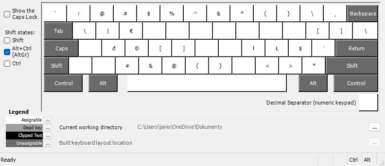

# Czech Keyboard Layout for Windows (Ubuntu Style)

Replikace českého rozložení klávesnice z Ubuntu pro Windows. Ideální pro uživatele přecházející z Linuxu. Anglická klávesnice přístupná pod pravou klávesou ALT. Česká klávesnice zůstává nezměněná.

## 📸 Ukázky

Rozložení kláves po stistknutí klávesy ALTGr(klikni pro rozbalení)

Standartní / Pravá klávesa ALT

| Standartní | ALTGr |
|------------------------|--------|
|  |  |

## 💾 Instalace
1. Stáhni instalační balíček z [Releases sekce](https://github.com/tvuj_username/czech-win-keyboard-like-ubuntu/releases)
2. Spusť `setup.exe`
3. Restartuj počítač
4. Přejdi do:
   **Nastavení > Čas a jazyk > Jazyk > Klávesnice > Přidat klávesnici **

## 🛠 Pro vývojáře
Pokud chceš upravit layout:
1. Otevři `czech_ubuntu.klc` v [Microsoft Keyboard Layout Creator](https://www.microsoft.com/en-us/download/details.aspx?id=102134)
2. Proveď změny
3. Sestav projekt (Build DLL and Setup Package)

## 📄 Licence
Distribuováno pod [MIT licencí](LICENSE). Můžeš volně používat, modifikovat a šířit.